<h1 align= "center" size="30px"><b><u>Introduction to 5G telecommunication</b></u> </h1>
<ul>
<li><h2>ITU :</h2>
stands for International Telecommunication Union, An international union formed to standardize the concept of wireless (5G for our topic) because wothout standardisation every other region would have their unique system of telecommunication which would've been a problem for the user to while travelling and a problem for its own betterment because no one would've had a standard idea and everyone would've going forward in their unique system.
<li><h2>5G requirements:</h2> 
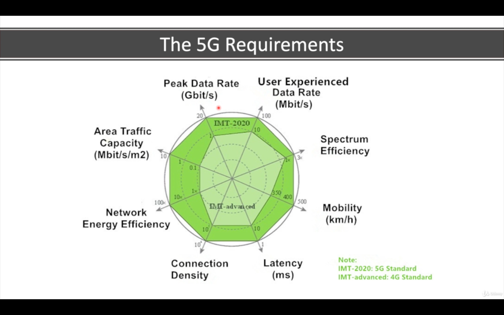

The inner web is for 4G and the outer for 5G.
<ol>
<li>Peak Data rate (Gbit/s)- when the user is in ideal condition, and is the only one using the network then the data rate delivered to user by the cell is peak data rate</li>
<li>User experinced data rate (Mbit/s)- The data rate experienced by user on an average when user tests the speed of the network </li>
<li>Spectral efficiency- The amount of data transmitted per hertz in one second, it is expressed as bits per second per hertz</li>
<li>Mobility- It is defined as till what speed the user can access the network, which is 500 km/h for 5G.</li>
<li>Latency- The delay in the transmission of packets from one end of network to other, in 5G it is 1ms.</li>
<li>Connection Density-maximum uses per square kilometre, for 5G it is 10 6.</li>
<li> Network Energy Efficiency- to what extent should we reduce the energy used in sending 1 bit of data, for 5G it is 100x lesser.</li>
<li>Area Traffic Capacity- It specifies how many Mega bites we have to serve per square metre.</li>
</ol>
<li><h2>3GPP- 3rd Generation Partenership Project:</h2>
The organisation where Telecommunication organisation from different countries unite to develope the set of technologies requred by 5G specified by ITU (International Telecommunication Union). 
Companies like Apple, Samsung, Mediatek, etc also aontribute in the process of standardisation with 3GPP 
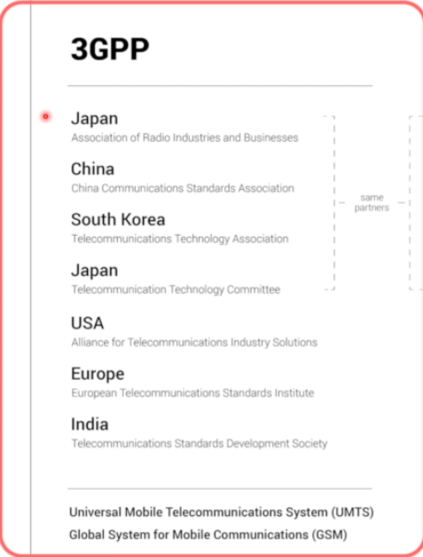
<h2>3GPP2:</h2>
A competing organisation who is responsible for creating better alternative solution to the techs created by 3GPP 
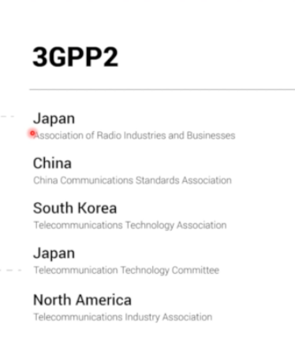
 
<h2>Structure of 3GPP :</h2>
it is devided into three Techinical specification groups (TSG)
 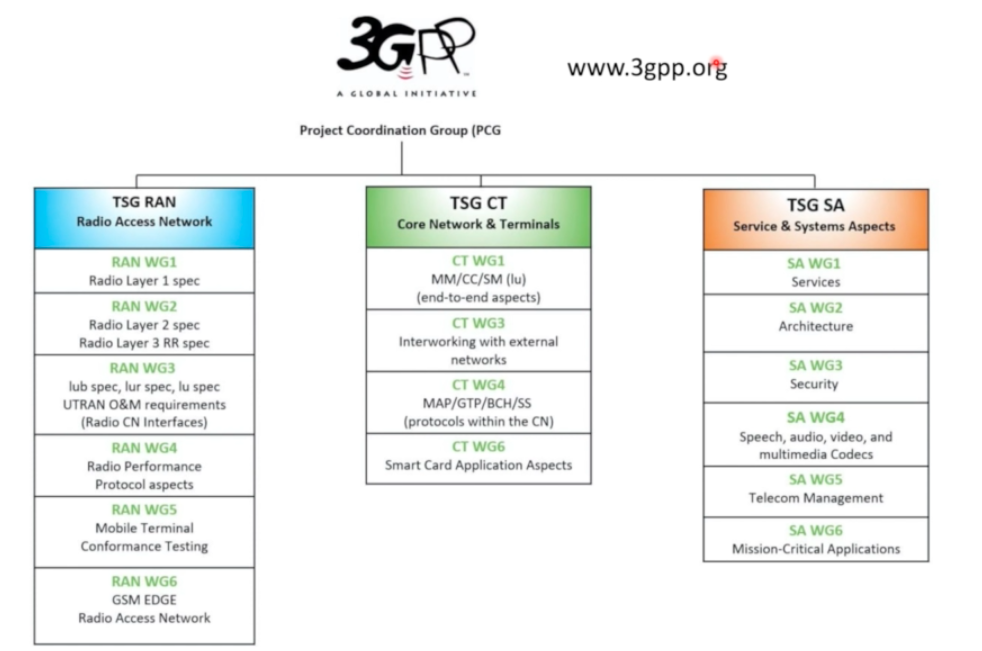 
<ol>
<li>The first group deals with the topics related to wireless comminication</li>
<li>The second group deals with mobility, security, etc. </li>
<li> The third TSG group deals with Architecture, multimedia codecs, etc.</li>
</ol>
<li><h2>Relations between ITU and 3GPP : </h2>
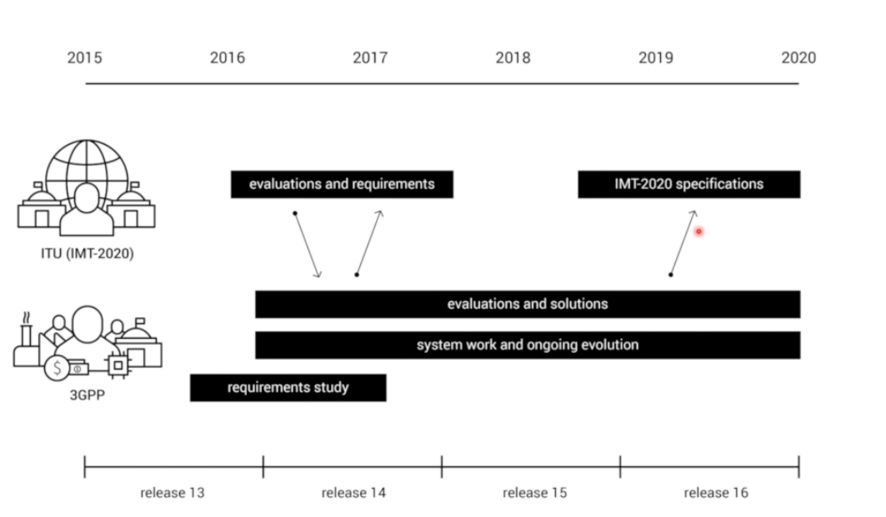 
First ITU tells the requirements and evalutions to 3GPP, then 3GPP studies the requirement, does evealutation and creates a solution, later presents it to ITU, then ITU checks the solution and officially confirms that it fulfills the requirement or not.</li>
<li> <h2>Timeline of releases by 3GPP :</h2>
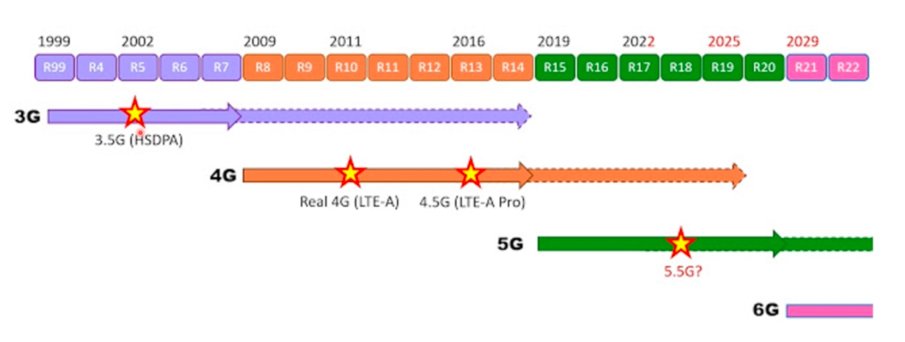
the concept of 3G was introduced in 1999 naming it R99(Release 99) but later the order changed from 99 to 4,5,etc. then it took 10 years to introduce 4G which was R8, so it takes roughly 10 years to go from one generation to next, which gives the reason why 5G was introduced in 2019 being R15, now in 2024 5.5G appeared and by 2029 6G will be introduced.</li>
<h1 align="center"><b><u>5G Wireless Networks</u></b></h1>

<ul>
<li><h2>1. 5G Use Cases</h2>

5G is designed around three main pillars (ITU defines them as IMT-2020 requirements):

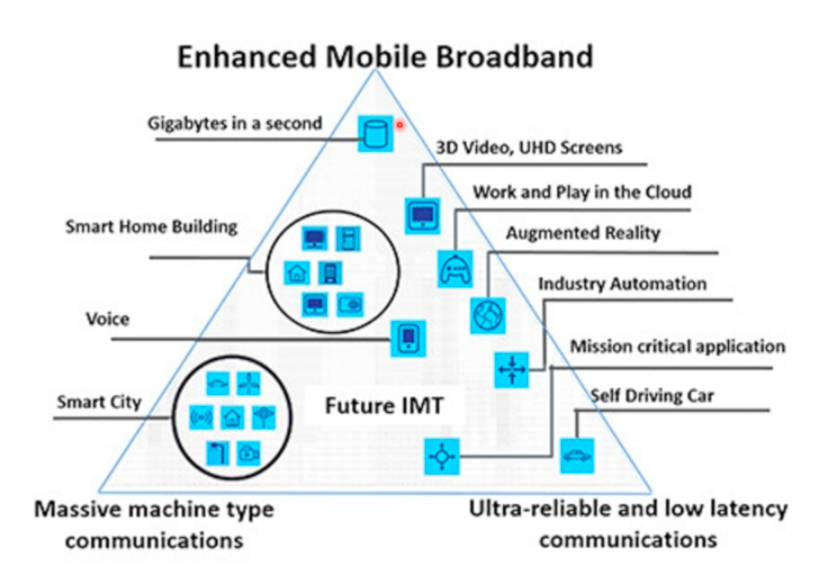
<ol>
<li><b>eMBB (Enhanced Mobile Broadband):</b> High data rates for things like 4K streaming, VR/AR, and cloud gaming.</li>
<li><b>mMTC (Massive Machine-Type Communication):</b> Connects up to 1 million IoT devices per km², useful in smart cities and industry automation.</li>
<li><b>URLLC (Ultra-Reliable Low-Latency Communication):</b> Latency as low as 1 ms, critical for remote surgery, autonomous cars, and robotics.</li>
</ol>
</li>

<li><h2>2. 5G System Architecture</h2>

The 5G system is made up of three big parts: User Equipment (UE), Radio Access Network (RAN), and 5G Core (5GC).

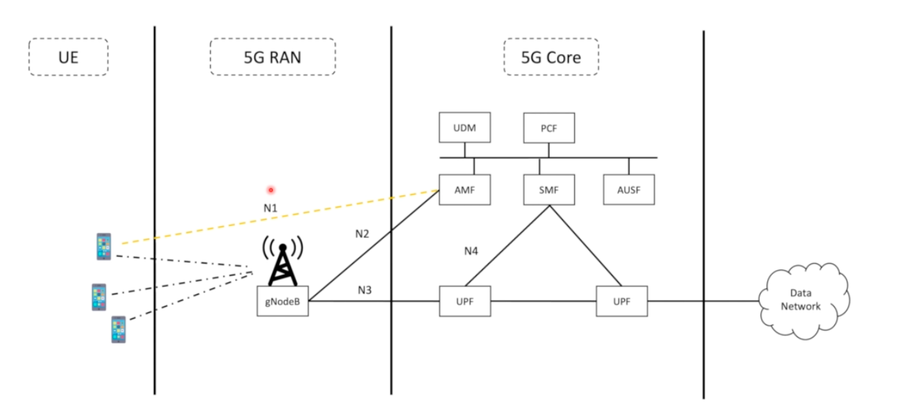
<ol>
<li><b>UE:</b> Devices like phones, IoT sensors, laptops that connect to 5G.</li>
<li><b>RAN:</b> gNodeBs (base stations) that handle radio connections.</li>
<li><b>5GC:</b> The brain of the system. It has key functions:
    <ul>
    <li><b>AMF:</b> Access and mobility management. Supports the device to move between diff radio cells, establishes encrypted signal in device which helps it in registering to get the access</li>
    <li><b>UDM:</b>User Data Management, manages user's subscription and all and supports AMF with that data in establishing access</li>
    <li><b>SMF:</b> Session management. provides IPs when session is running and releases the session when activity is done by user</li>
    <li><b>UPF:</b> User data forwarding.</li>
    <li><b>AUSF:</b> Authentication and security.Manages the security part of the system</li>
    <li><b>PCF:</b> Policy control and QoS decisions.Manages the policies like if a user is not allowed to access network in a certain area, PCF will come to play and stops the access</li>
    </ul>
</li>
</ol>

<b>Special Features:</b>

<ol>
<li><b>Network Slicing:</b> Virtual networks on the same infrastructure. Example: one slice for hospitals, another for gaming, another for IoT. 
<li><b>Service-Based Architecture (SBA):</b> 5G core functions talk to each other using APIs (like web apps) instead of fixed links, making it flexible and modular. 
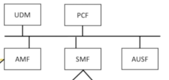</li>
</ol>
</li>

<li><h2>3. Deployment Options</h2>

There are two strategies for deploying 5G:

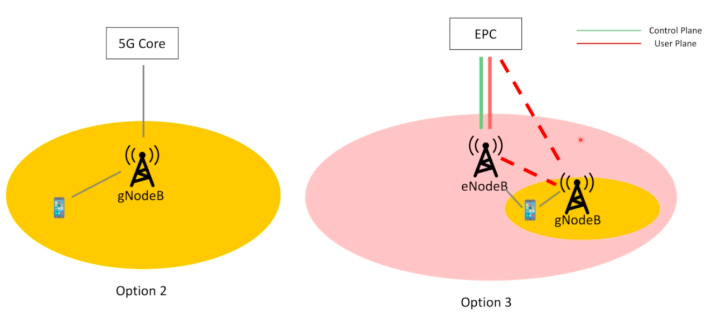
<ul>
<li><b>NSA (Non-Standalone):</b> Uses 5G radio with 4G core (EPC). Quick and cheaper to deploy, but lacks full 5G features. Example: Jio & Airtel initial 5G.</li>
<li><b>SA (Standalone):</b> Uses 5G radio with 5G core. True 5G features like slicing, URLLC, and IoT, but costlier to deploy.</li>
</ul>

<h3>Deployment Options (1–7):</h3>
<ol>
<li><b>Option 1:</b> The network in 4G and the RAN is eNodeB(4G RAN)  
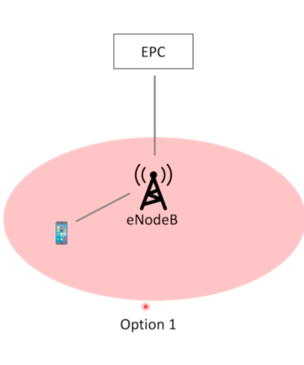</li>
<li><b>Option 2:</b> Main network is 5G core and RAN is gNodeB(5G RAN) 
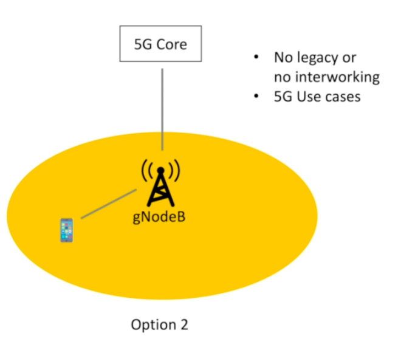 </li>
<li><b>Option 3 (EN-DC):</b> While the main network is EPC(4G), there comes dual connectivity, both eNodeG and gNodeB co-exist 
Option 3: The eNodeB connects to EPC and then shares the required network with gNodeB, no direct contact between EPC and gNodeB 
Option 3a: The EPC is connected to both eNodeB and gNodeB which reduces the latency but due to absence of 4G RAN between EPC and 5G RAN comes with a risk in a area where 5G stability is not good. 
Option 3x: the best and most common option so far, combination of option 3 and 3a, if 5G stability is good then direct path will be followed but if its not good then the path via eNodeB will be followed. 
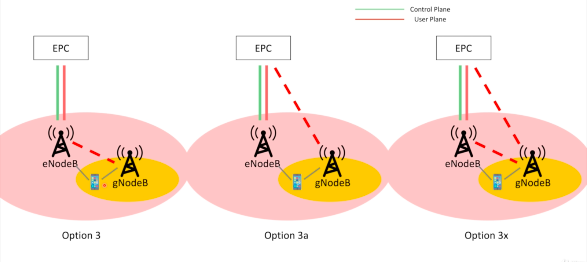</li>
<li><b>Option 4:</b> Main network is 5GC and dual connectivity is there  
Option 4: 5GC is connected with gNodeB and gNodeB shares the required data with eNodeB 
Option 4a: eNodeB and gNodeB are both directly connected with 5GC. 
Option 4x: it is not a very likely option. 
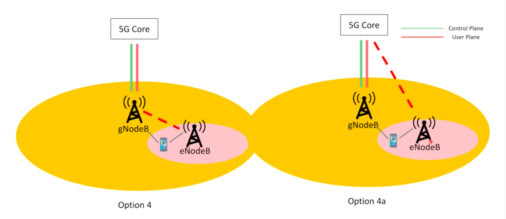
</li>
<li><b>Option 5:</b> The main network is 5GC, but device has access to LTE only, so the LTE is upgraded to understand the protocols of 5GC and then its called eLTE (e stands for enhanced) 
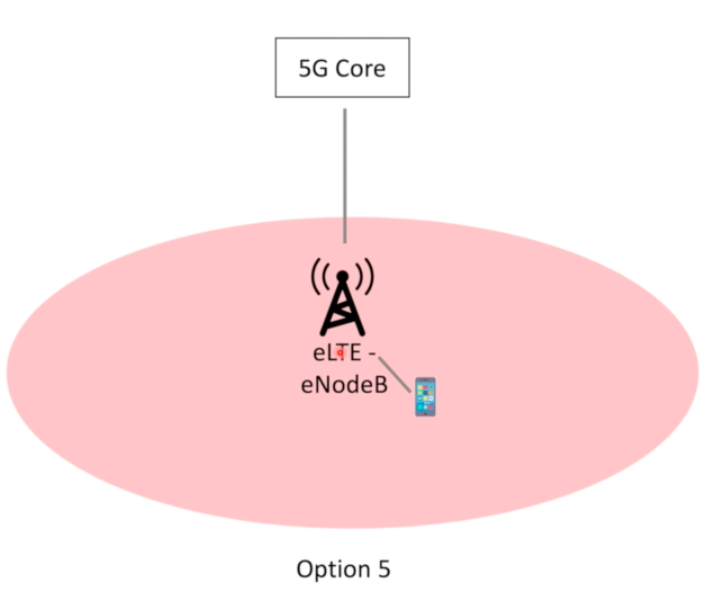</li>
<li><b>Option 6:</b> Here the network is 4GC, but device has access to gNodeB only (it is not supported) 
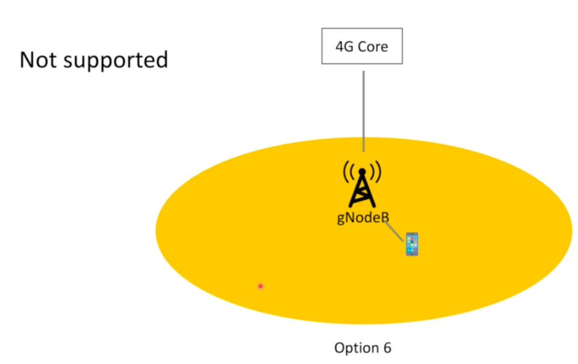</li>
<li><b>Option 7 (NG-EN-DC):</b> It is same as option 4 but the master access technology is eNodeB and secondary is gNodeB, this was the reason of the inexistence of Option 4x
 
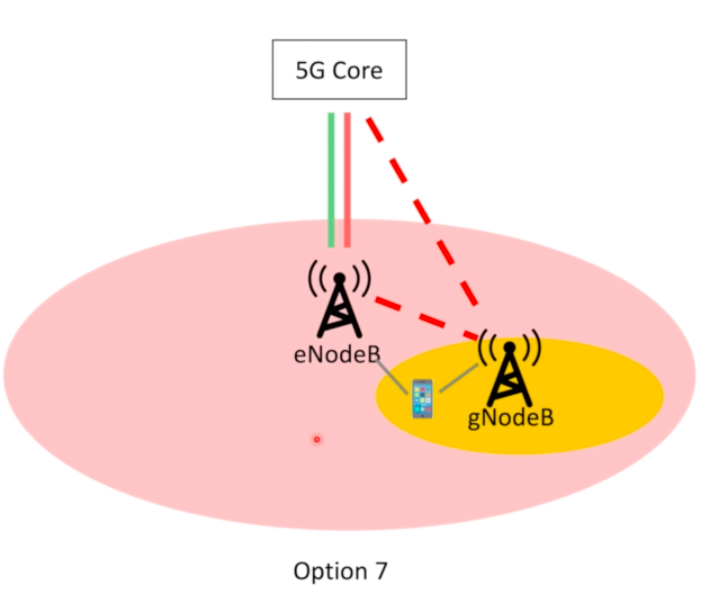</li>
</ol>
</li> 
</ul>
<h1 align= "center"> <b><u>RAN Procotol stack</u></b></h1>
<ol>
<li><h2> User Plane Protocol stack</h2>

It support carying the user data from one application to another in the UE and Network
 

<b><h3>Layers :</h3></b>
<ul>
<li><b>phy layer-</b> It is the closest to hardware and performs modulation, basically it converts bits into radio waves.
<li><b>MAC layer-</b> It multiplexes, demultiplexes, schedules channels and all, basically decided which one will speak at what time and what frequency.
<li><b>RLC layer-</b> It performs robust error detection and it's main work is to chop big data into smaller IP packets and later puts them back together in a process called reassembly. 
<li><b>PDCP layer-</b> It reduces the size of packets and encrypts it and removes duplicates.
<li><b>SDAP layer-</b> every packet can't be treated same. like, a voice call packet can't be treated same as a search packet from google, they have to be assigned to different bearers. SDAP does that work, it seggregates the packets based their QoS(Quality of Service).
  
</ul>
</h2>
<li><h2> Control Plane Protocol stack</h2>

Supports carrying the control information between the user equipment and gNodeB 
 </h2>  <b><h3>Layers :</h3></b>
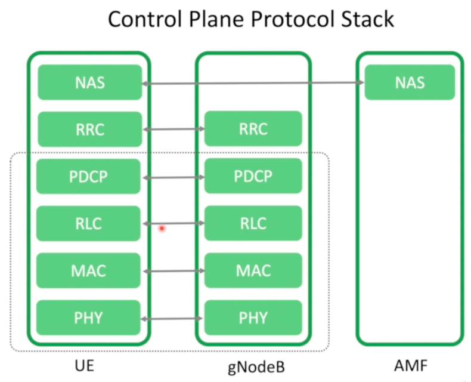
 All the layers are same except 2:
<ul>
<li><b>RRC layer-</b> It sets up the connection and then mentains it, works between UE and gNodeB.
<li><b>NAS layer-</b> Connects directly from device to Core network skipping base station. It is also responsible for assigning IPs to devices. 
<i>(In both the stacks, each layer provides services to the above layer and consumes services of the layers below, and each node communicates with the corresponding node, i.e: every node in UE communicates with corresponding node in gNodeB or core network)</i>
</ul> 
<h1><b><u>Key RAN Procedures</u></b></h1>
<ol>
<li><h2>Initial Access</h2>
The very first step a UE does when trying to connect to a 5G network. the UE finds the nearest gNodeB and learn its basic info like timing allignment, what frequency it uses, what ID the cell hac before connecting to it via the process of synchronisation.  <b>STEPS OF CELL SEARCH :</b>
<ul>
<li>UE detects the PSS (Primary Synchronisation Signal)→ gives timing within a slot and tells you the cell ID group.
<li>UE detects the SSS (Secondary Synchronisation Signal) → gives frame timing and completes the cell identity (0–1007 unique IDs in 5G).
<li>Inside PBCH (Physical Broadcast channel), UE reads the MIB (Master Information Block).then MIB gives system info like subcarrier spacing, system bandwidth, and scheduling for SIBs (more system info).</li>
<i><b>[All three of these steps combines to form SSB (Sync Signal Block)]</b></i>   
<b>There is a form called SSB burst:</b>
in that, each beam has it's own SSB 
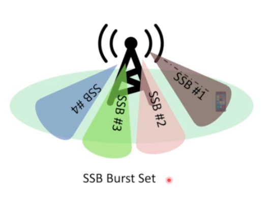
</ul>
<li><h2>Random Access</h2>
<ol type="A">
<li><b>Triggers:</b> 
<ul><li>when device wants to go from RRC idle to RRC connected, such as during power on or entering coverage area for the first time
<li>When the device has to send Uplink data
<li>When the sync has been lost with the current cell due to long period of inactivity.
<li>When the sync has to be established with a new cell during handover.
</ul>
<li><b>Steps </b>
<ul><li><b>Random Access Preamble: </b> The UE sends a preamble on PRACH (Physical Random Access CHannel) so that it estimates the timing offset (how far is UE), from multiple preambles UE picks one randomly.
<li><b>Random Access Response:</b> The gNodeB responds with timing connection, temporary ID and resource for next uplink.
<li><b>Scheduled Transmission (Msg3):</b> UE sends a message using uplink given which contains the UE identity, This step causes contention if multiple UEs pick same preamble.
<li><b>Contention Resolution (Msg4): </b> The gNodeB sends a message that which UE's identity is accepted, if a UE can't see its ID it knows it lost and it retries.
<li><b>Connection Setup: </b> After the resolution of contention, RRC and NAS procedure begins and secure connection setup starts.
</ol>
<h1><b><u>Identifiers</u></b></h1>
5G has two major Identifiers: Device Identity and Subscription Identifier. 
<ol> <li><b>Device Identity</b>
<ul><b>PEI -</b> short for Permanent Equipment Identifier, Each UE has its own unique PEI which is stored in the device. It has two formats  
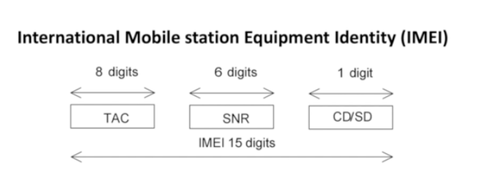   It takes accord of only Hardware serial number.  
 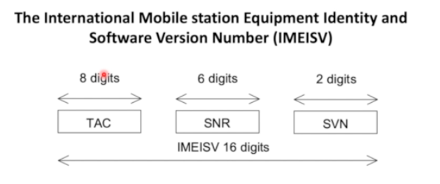 It considers software serial number too 
<i>TAC- Type Allocation Code 
SNR- Serial Number 
CD-Check Digit 
SD-Spare Digit 
SVN-Software Version Number 
</i></ul>
<li><b>Subscription Identifier</b> 
<ul><li><b>SUPI - </b> stands for Subscription Permanent Identity 
If device has 5G network then IMSI (International Mobile Subscriber Identifier) will be used, If WiFi is connected then NAI (Network Access Identifier) will be used: 
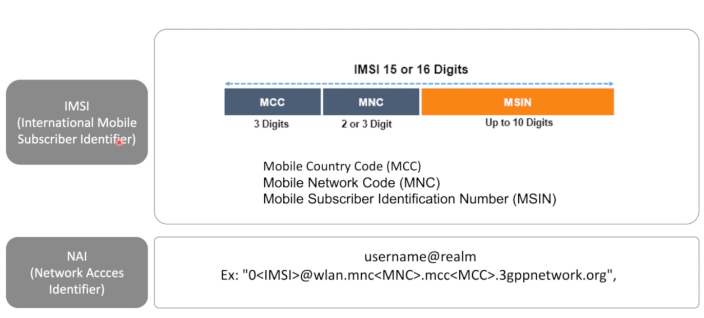 
<i>MCC- Mobile Country Code 
MNC- Mobile Network Code 
MSIN- Mobile Subscriber Identification Number </i>
<li><b>SUCI - </b>Stands for Subscryption Conealed Identity, to resolve the problem of IMSI catching, instead of directly sending IMSI, SUCI is sentand the Man in the middle doesn't have key to decrypt the encryption. 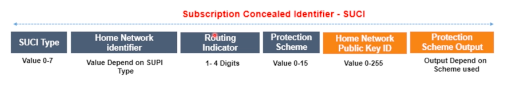</li>
<li><b>GUTI - </b>Stands for Globally Unique Temporary Identifier 
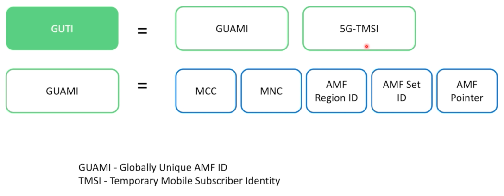
</li></ul></ol>
<h1><b><u>Service based Architecture</u></b></h1>
<ol><li><b>Microservices</b> 
Earlier there used to be a whole big Monolithic architecture   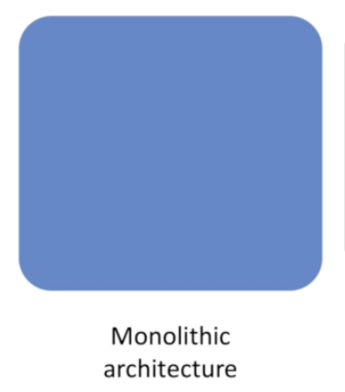 
for any modification, this whole arch. has to be changed but after the introduction of Multiservices modification became easier, as it made whole system flexible. If a service is overloaded, just create one more of that one service only, and what not. All the microservices are connected with common simple interface.  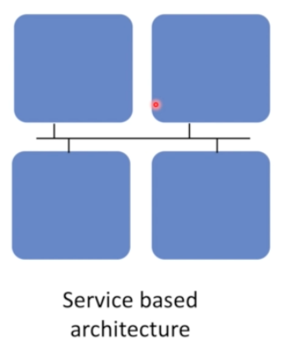
<li><b>Service based Arch. Vs Refrence Point</b>
 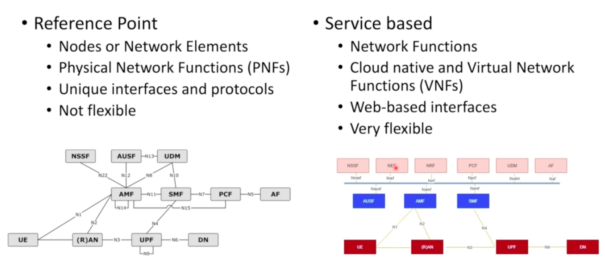
<li><b>Interface between Network Functions: </b>
It uses rest based interface, it has very simple commands 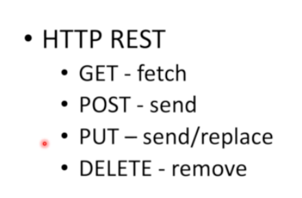
<li><b>Service Registration</b>  for ex. we're adding a new PCF to the Network, so this is how the task will be registered 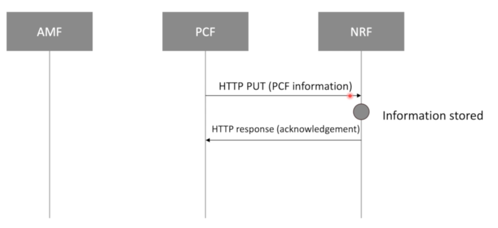
<li><b>Service Discovery - NRF</b>  
It tells how the NRF acts as an dictionary and helps in tracking the NFs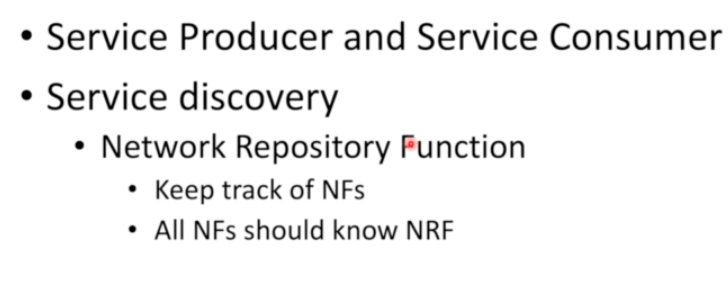  And this is how it works for ex if we've registered a PCF and now AMF wants to communicate with it but don't know where it is 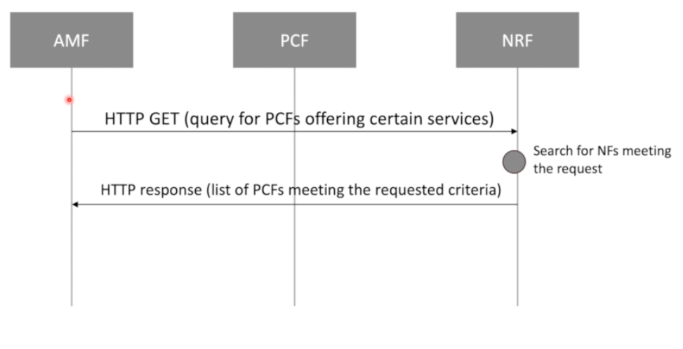
<li><b>Service Request</b> 
Now that we've registered a PCF, found it's location, so now the AMF communicates with PCF and this is how it happens: 
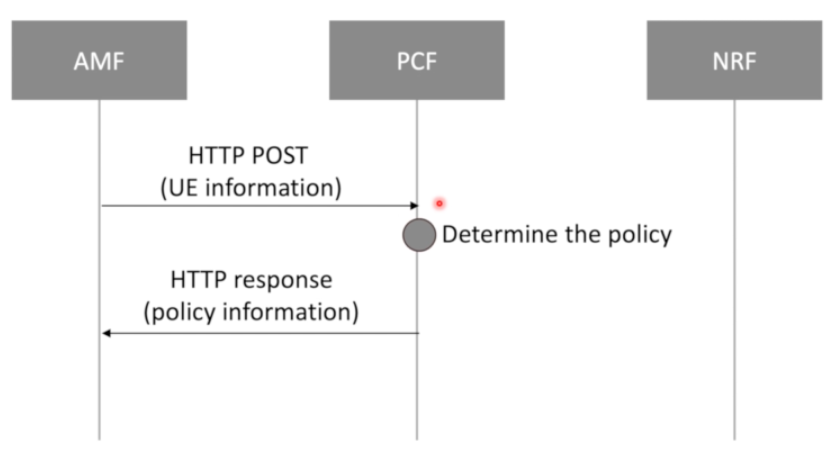
<li><b>Call Flow for summary purpose: </b> 
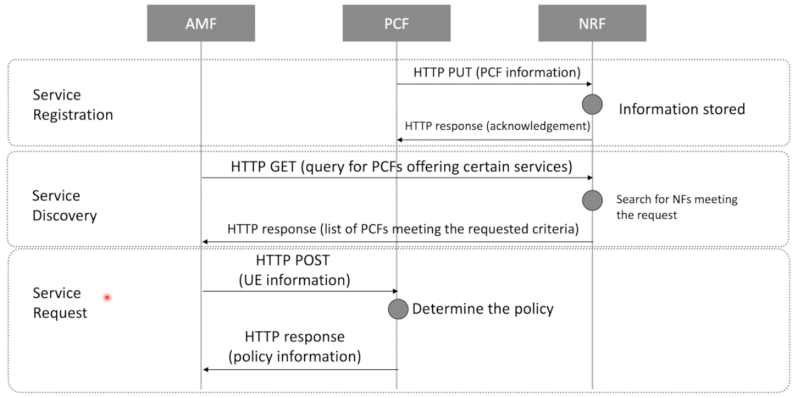
