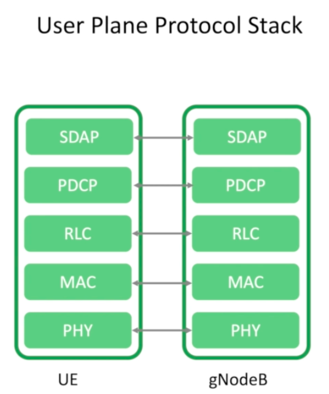
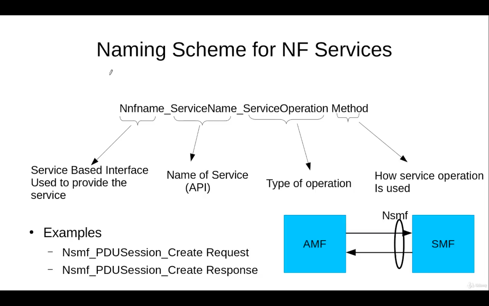

<h1 align= "center" size="30px"><b><u>Introduction to 5G telecommunication</b></u> </h1>
<ul>
<li><h2>ITU :</h2>
stands for International Telecommunication Union, An international union formed to standardize the concept of wireless (5G for our topic) because wothout standardisation every other region would have their unique system of telecommunication which would've been a problem for the user to while travelling and a problem for its own betterment because no one would've had a standard idea and everyone would've going forward in their unique system.
<li><h2>5G requirements:</h2> 

The inner web is for 4G and the outer for 5G.
<ol>
<li>Peak Data rate (Gbit/s)- when the user is in ideal condition, and is the only one using the network then the data rate delivered to user by the cell is peak data rate</li>
<li>User experinced data rate (Mbit/s)- The data rate experienced by user on an average when user tests the speed of the network </li>
<li>Spectral efficiency- The amount of data transmitted per hertz in one second, it is expressed as bits per second per hertz</li>
<li>Mobility- It is defined as till what speed the user can access the network, which is 500 km/h for 5G.</li>
<li>Latency- The delay in the transmission of packets from one end of network to other, in 5G it is 1ms.</li>
<li>Connection Density-maximum uses per square kilometre, for 5G it is 10 6.</li>
<li> Network Energy Efficiency- to what extent should we reduce the energy used in sending 1 bit of data, for 5G it is 100x lesser.</li>
<li>Area Traffic Capacity- It specifies how many Mega bites we have to serve per square metre.</li>
</ol>
<li><h2>3GPP- 3rd Generation Partenership Project:</h2>
The organisation where Telecommunication organisation from different countries unite to develope the set of technologies requred by 5G specified by ITU (International Telecommunication Union). 
Companies like Apple, Samsung, Mediatek, etc also aontribute in the process of standardisation with 3GPP 

<h2>3GPP2:</h2>
A competing organisation who is responsible for creating better alternative solution to the techs created by 3GPP 

 
<h2>Structure of 3GPP :</h2>
it is devided into three Techinical specification groups (TSG)
  
<ol>
<li>The first group deals with the topics related to wireless comminication</li>
<li>The second group deals with mobility, security, etc. </li>
<li> The third TSG group deals with Architecture, multimedia codecs, etc.</li>
</ol>
<li><h2>Relations between ITU and 3GPP : </h2>
 
First ITU tells the requirements and evalutions to 3GPP, then 3GPP studies the requirement, does evealutation and creates a solution, later presents it to ITU, then ITU checks the solution and officially confirms that it fulfills the requirement or not.</li>
<li> <h2>Timeline of releases by 3GPP :</h2>

the concept of 3G was introduced in 1999 naming it R99(Release 99) but later the order changed from 99 to 4,5,etc. then it took 10 years to introduce 4G which was R8, so it takes roughly 10 years to go from one generation to next, which gives the reason why 5G was introduced in 2019 being R15, now in 2024 5.5G appeared and by 2029 6G will be introduced.</li>
<h1 align="center"><b><u>5G Wireless Networks</u></b></h1>

<ul>
<li><h2>1. 5G Use Cases</h2>

5G is designed around three main pillars (ITU defines them as IMT-2020 requirements):

<ol>
<li><b>eMBB (Enhanced Mobile Broadband):</b> High data rates for things like 4K streaming, VR/AR, and cloud gaming.</li>
<li><b>mMTC (Massive Machine-Type Communication):</b> Connects up to 1 million IoT devices per km², useful in smart cities and industry automation.</li>
<li><b>URLLC (Ultra-Reliable Low-Latency Communication):</b> Latency as low as 1 ms, critical for remote surgery, autonomous cars, and robotics.</li>
</ol>
</li>

<li><h2>2. 5G System Architecture</h2>

The 5G system is made up of three big parts: User Equipment (UE), Radio Access Network (RAN), and 5G Core (5GC).

<ol>
<li><b>UE:</b> Devices like phones, IoT sensors, laptops that connect to 5G.</li>
<li><b>RAN:</b> gNodeBs (base stations) that handle radio connections.</li>
<li><b>5GC:</b> The brain of the system. It has key functions:
    <ul>
    <li><b>AMF:</b> Access and mobility management. Supports the device to move between diff radio cells, establishes encrypted signal in device which helps it in registering to get the access</li>
    <li><b>UDM:</b>User Data Management, manages user's subscription and all and supports AMF with that data in establishing access</li>
    <li><b>SMF:</b> Session management.establishes and manages PDU sessions,interacts with PCF for policy discussion about QoS, provides IPs when session is running and releases the session when activity is done by user</li>
    <li><b>UPF:</b> User data forwarding.</li>
    <li><b>AUSF:</b> Authentication and security.Manages the security part of the system</li>
    <li><b>PCF:</b> Policy control and QoS decisions.Manages the policies like if a user is not allowed to access network in a certain area, PCF will come to play and stops the access</li>
    </ul>
</li>
</ol>

<b>Special Features:</b>

<ol>
<li><b>Network Slicing:</b> Virtual networks on the same infrastructure. Example: one slice for hospitals, another for gaming, another for IoT. 
<li><b>Service-Based Architecture (SBA):</b> 5G core functions talk to each other using APIs (like web apps) instead of fixed links, making it flexible and modular. 
</li>
</ol>
</li>

<li><h2>3. Deployment Options</h2>

There are two strategies for deploying 5G:

<ul>
<li><b>NSA (Non-Standalone):</b> Uses 5G radio with 4G core (EPC). Quick and cheaper to deploy, but lacks full 5G features. Example: Jio & Airtel initial 5G.</li>
<li><b>SA (Standalone):</b> Uses 5G radio with 5G core. True 5G features like slicing, URLLC, and IoT, but costlier to deploy.</li>
</ul>

<h3>Deployment Options (1–7):</h3>
<ol>
<li><b>Option 1:</b> The network in 4G and the RAN is eNodeB(4G RAN)  
</li>
<li><b>Option 2:</b> Main network is 5G core and RAN is gNodeB(5G RAN) 
 </li>
<li><b>Option 3 (EN-DC):</b> While the main network is EPC(4G), there comes dual connectivity, both eNodeG and gNodeB co-exist 
Option 3: The eNodeB connects to EPC and then shares the required network with gNodeB, no direct contact between EPC and gNodeB 
Option 3a: The EPC is connected to both eNodeB and gNodeB which reduces the latency but due to absence of 4G RAN between EPC and 5G RAN comes with a risk in a area where 5G stability is not good. 
Option 3x: the best and most common option so far, combination of option 3 and 3a, if 5G stability is good then direct path will be followed but if its not good then the path via eNodeB will be followed. 
</li>
<li><b>Option 4:</b> Main network is 5GC and dual connectivity is there  
Option 4: 5GC is connected with gNodeB and gNodeB shares the required data with eNodeB 
Option 4a: eNodeB and gNodeB are both directly connected with 5GC. 
Option 4x: it is not a very likely option. 

</li>
<li><b>Option 5:</b> The main network is 5GC, but device has access to LTE only, so the LTE is upgraded to understand the protocols of 5GC and then its called eLTE (e stands for enhanced) 
</li>
<li><b>Option 6:</b> Here the network is 4GC, but device has access to gNodeB only (it is not supported) 
</li>
<li><b>Option 7 (NG-EN-DC):</b> It is same as option 4 but the master access technology is eNodeB and secondary is gNodeB, this was the reason of the inexistence of Option 4x
 
</li>
</ol>
</li> 
</ul>
<h1 align= "center"> <b><u>RAN Procotol stack</u></b></h1>
<ol>
<li><h2> User Plane Protocol stack</h2>

It support carying the user data from one application to another in the UE and Network
 

<b><h3>Layers :</h3></b>
<ul>
<li><b>phy layer-</b> It is the closest to hardware and performs modulation, basically it converts bits into radio waves.
<li><b>MAC layer-</b> It multiplexes, demultiplexes, schedules channels and all, basically decided which one will speak at what time and what frequency.
<li><b>RLC layer-</b> It performs robust error detection and it's main work is to chop big data into smaller IP packets and later puts them back together in a process called reassembly. 
<li><b>PDCP layer-</b> It reduces the size of packets and encrypts it and removes duplicates.
<li><b>SDAP layer-</b> every packet can't be treated same. like, a voice call packet can't be treated same as a search packet from google, they have to be assigned to different bearers. SDAP does that work, it seggregates the packets based their QoS(Quality of Service).
  
</ul>
</h2>
<li><h2> Control Plane Protocol stack</h2>

Supports carrying the control information between the user equipment and gNodeB 
 </h2>  <b><h3>Layers :</h3></b>

 All the layers are same except 2:
<ul>
<li><b>RRC layer-</b> It sets up the connection and then mentains it, works between UE and gNodeB.
<li><b>NAS layer-</b> Connects directly from device to Core network skipping base station. It is also responsible for assigning IPs to devices. 
<i>(In both the stacks, each layer provides services to the above layer and consumes services of the layers below, and each node communicates with the corresponding node, i.e: every node in UE communicates with corresponding node in gNodeB or core network)</i>
</ul> 
<h1><b><u>Key RAN Procedures</u></b></h1>
<ol>
<li><h2>Initial Access</h2>
The very first step a UE does when trying to connect to a 5G network. the UE finds the nearest gNodeB and learn its basic info like timing allignment, what frequency it uses, what ID the cell hac before connecting to it via the process of synchronisation.  <b>STEPS OF CELL SEARCH :</b>
<ul>
<li>UE detects the PSS (Primary Synchronisation Signal)→ gives timing within a slot and tells you the cell ID group.
<li>UE detects the SSS (Secondary Synchronisation Signal) → gives frame timing and completes the cell identity (0–1007 unique IDs in 5G).
<li>Inside PBCH (Physical Broadcast channel), UE reads the MIB (Master Information Block).then MIB gives system info like subcarrier spacing, system bandwidth, and scheduling for SIBs (more system info).</li>
<i><b>[All three of these steps combines to form SSB (Sync Signal Block)]</b></i>   
<b>There is a form called SSB burst:</b>
in that, each beam has it's own SSB 

</ul>
<li><h2>Random Access</h2>
<ol type="A">
<li><b>Triggers:</b> 
<ul><li>when device wants to go from RRC idle to RRC connected, such as during power on or entering coverage area for the first time
<li>When the device has to send Uplink data
<li>When the sync has been lost with the current cell due to long period of inactivity.
<li>When the sync has to be established with a new cell during handover.
</ul>
<li><b>Steps </b>
<ul><li><b>Random Access Preamble: </b> The UE sends a preamble on PRACH (Physical Random Access CHannel) so that it estimates the timing offset (how far is UE), from multiple preambles UE picks one randomly.
<li><b>Random Access Response:</b> The gNodeB responds with timing connection, temporary ID and resource for next uplink.
<li><b>Scheduled Transmission (Msg3):</b> UE sends a message using uplink given which contains the UE identity, This step causes contention if multiple UEs pick same preamble.
<li><b>Contention Resolution (Msg4): </b> The gNodeB sends a message that which UE's identity is accepted, if a UE can't see its ID it knows it lost and it retries.
<li><b>Connection Setup: </b> After the resolution of contention, RRC and NAS procedure begins and secure connection setup starts.
</ol>
<h1><b><u>Identifiers</u></b></h1>
5G has two major Identifiers: Device Identity and Subscription Identifier. 
<ol> <li><b>Device Identity</b>
<ul><b>PEI -</b> short for Permanent Equipment Identifier, Each UE has its own unique PEI which is stored in the device. It has two formats  
   It takes accord of only Hardware serial number.  
  It considers software serial number too 
<i>TAC- Type Allocation Code 
SNR- Serial Number 
CD-Check Digit 
SD-Spare Digit 
SVN-Software Version Number 
</i></ul>
<li><b>Subscription Identifier</b> 
<ul><li><b>SUPI - </b> stands for Subscription Permanent Identity 
If device has 5G network then IMSI (International Mobile Subscriber Identifier) will be used, If WiFi is connected then NAI (Network Access Identifier) will be used: 
 
<i>MCC- Mobile Country Code 
MNC- Mobile Network Code 
MSIN- Mobile Subscriber Identification Number </i>
<li><b>SUCI - </b>Stands for Subscryption Conealed Identity, to resolve the problem of IMSI catching, instead of directly sending IMSI, SUCI is sentand the Man in the middle doesn't have key to decrypt the encryption. </li>
<li><b>GUTI - </b>Stands for Globally Unique Temporary Identifier 

</li></ul></ol>
<h1><b><u>Service based Architecture</u></b></h1>
<ol><li><b>Microservices</b> 
Earlier there used to be a whole big Monolithic architecture    
for any modification, this whole arch. has to be changed but after the introduction of Multiservices modification became easier, as it made whole system flexible. If a service is overloaded, just create one more of that one service only, and what not. All the microservices are connected with common simple interface.  
<li><b>Service based Arch. Vs Refrence Point</b>
 
<li><b>Interface between Network Functions: </b>
It uses rest based interface, it has very simple commands 
<li><b>Service Registration</b>  for ex. we're adding a new PCF to the Network, so this is how the task will be registered 
<li><b>Service Discovery - NRF</b>  
It tells how the NRF acts as an dictionary and helps in tracking the NFs  And this is how it works for ex if we've registered a PCF and now AMF wants to communicate with it but don't know where it is 
<li><b>Service Request</b> 
Now that we've registered a PCF, found it's location, so now the AMF communicates with PCF and this is how it happens: 

<li><b>Call Flow for summary purpose: </b> 

<h1><b><u>Registration Procedure</u></b></h1>
<ol><li><b>Initial Registration</b>
When a Device is powered on, an initial registration takes place.
<li><b>Periodic Registration</b>
A periodic registration has to take place periodically to ensure that the device hasn't ran out of battery or broken in some sense.
<li><b>Mobility Registration</b>
While travelling, the device have to register itself.
<li><b>Emergency Registration</b> 
If a device doesn't have subscription, still if it wants to use emergency service,it will have to register itself.
</ol>
<h1><b><u>Key Features</u></b></h1>
<ol>
<li>Dual connectivity</li>
<li>Small Cells</li>
<li>Increased Spectrum</li>
<li>Radio enhancement</li>
<li>Beam Forming and Steering</li>
<li>Cloud RAN</li>
</ol>
<h1><b><u>MIMO Vs Beamforming</u></b></h1>
<ul>
<li><b>MIMO-</b> stands for Multiple input multiple output, multiple antennas are used at both reciever and trasmitter sides and, sends multiple data streams in parallel to improve data speed and capacity</li>
<li><b>Beamforming-</b> uses antennas to focus signal in one direction instead of broadcasting everywhereto improve signal strength, coverage and reliability. frequency suited for it is above 6GHz</li></ul>
<h1><b><u>PDU Sessions</u></b></h1>
stands for Protocol Data unit, in 5G every bit of data travels in the form of IP packets and to do all that, the network needs to establish a PDU session
<h1><b><u>Control plane Flow</u></b></h1>
When UE attaches → AMF handles login → AUSF verifies → UDM provides profile → SMF sets up data path → PCF applies rules.
<h1><b><u>Power On procedure</b></h1>
<ol>
    <li>UE discovers nearby cells by reading their PSS and SSS</li>
    <li>Authentication process begins via AKA(Authentication and Key Agreement) which relies on a secret key that is used for a mutual connection</li>
    <li>UE context installation process begins, what is the bandwidth, what is the subscriber status, etc</li>
    <li>UE performs a policy check based on time of the day, location of the user,network congestion, etc</li>
    <li>A temporary ID gets allocated to subscriber, called TMSI</li>
</ol>
<h1><b><u>More about Service Based Architecture</u></b></h1>
<ul>
    <li>The communication between NFs is done using HTTP/2, it is widely deployed so it has well developed security mechanisms and third party applications, In web HTTP/2 works with different type of files like jpg, pdf, HTML. But in 5G core it only works with .json content </li>
    <li>The context, QoS policies or any registration in NF is a type of Resource and Resources are locsted and manipulated as Uniform Resource Identifier (URI)</li>
    <li>The HTTP methods used in 5GC are 
    <ol>
        <li>PUT- creates or replaces a resource</li>
        <li>GET- only reads a resource</li>
        <li> PATCH- Partially updates a resource</li>
        <li>Delete- Deletes a resource</li>
        <li>POST- to create a resource, to process that enclosed resource, to execute a remote call</li>
    </li>
    </ol>
        <li>The HTTP responses are:
        <ol>
            <li>2xx- Success
            <ul>
                <li>200- ok</li>
                <li>201- created</li>
                <li>202- Accepted</li>
            </ul>
            </li>
             <li>4xx- Client error
            <ul>
                <li>400- Bad request</li>
                <li>404- not found</li>
            </ul>
            </li>
             <li>5xx- Server error
            <ul>
                <li>500- Internal server error</li>
                <li>503- Server unreachable</li>
            </ul>
            </li>
        </li>
        </ol>
    <li>
    Naming Schemes: 
    
    </li>
    <li>REST is an architectural style for softwares and the rules of REST are applied on HTTP protocol and these are the principles of REST based design 
    
    
</ul>
<h1><b><u>Network Slicing</u></b></h1>
<ul><li>A network Slice instance is identified by the value of Slice/Service Type (SST)which is of 8 bit, for different values the service type is different  
<ul type="circle"><li>1- eMBB(enhanced Mobile broadband )</li>
<li>2- URLLC (Ultra Reliable Low Latency Communication)</li>
<li>3-  MIoT (Massive Internet of Things)</li>
<li>4- V2X (Vehicle to evrything)</li>
<li>5-127- Reserved for the future use</li>
<li>128-255- Used by operator to design its own slice</li></ul>
<li>At one time, a UE can be assigned with 8 Network slices at max, AMF will be same for all the sessions, but these slices can have multiple SMFs/UPFs</li>
<li>The Network Slice have 4 phases in its life cycle: prepareation, configuration and activation, Run time phase and lastly decommision. All the tasks in each phase are manages by NSMF(Network Slice Management Function)</li>
<li>In NSMM(Network Slice management model), the user gives its requirement to the Communication service provider which further translates it into a format which Network Slice provider can understand using CSMF and it is based on network type network capacity, QoS requirements then NSP further translates it into a format which NSSP can understand using NSMF and then the NSSP manages the NSSIs using NSSMF based on the requirements received from NSMF. 
</ul>
<h1><b><u>Voice over 5G</u></b></h1>
<ul type="disc">
<li>Introduction: <ul type="circle"><li>In 4G, voice calls used VoLTE (Voice over LTE), which sent calls as data packets instead of traditional circuit-switched voice.

<li>In 5G, the same concept continues — it’s called VoNR (Voice over New Radio) or Voice over 5G.

<li>Here, voice is transmitted over the 5G data network (NR + 5G Core) using IMS (IP Multimedia Subsystem).

<li>If 5G coverage is weak, the call may fall back to 4G (EPS fallback) to use VoLTE.
</ul>
<li>Codecs: Codec is used to compress and decompress the voice at reciever and transmitter end There are two codecs:
<ul type="circle"><li>EVS: Enhanced Voice service, it robusts delay jitter and packet losses</li>
<li>IVAS: Immersive Voice and audio Services, it is compatible from mono, sterio to fully immersive VRs, but its still under developement</li>
</ul>
<li>Session Initiation Protocol:
<ul type="circle">
<li>SIP is a signaling protocol used to set up, modify, and end voice/video calls over IP.

<li>It doesn’t carry voice data — it only handles control (call start, ring, connect, end).

<li>Actual voice packets flow via RTP (Real-time Transport Protocol) once SIP sets the session.
</ul>
<li>IP Multimedia Subsystem: <ul type="circle">
<li>IMS is the core network framework that enables IP-based voice, video, and messaging services (VoNR, VoLTE, etc.).

<li>It sits on top of the 5G Core (5GC) and works using SIP signaling.

<li>IMS connects the user (UE) to services like voice, video calls, conference calling.
<li>It has three main components:
    <ul><li>P-CSCF: It is like an entry point, forwards SIP and ensures security</li>
    <li>I-CSCF: It works like a router and finds user's serving node</li>
    <li>S-CSCF: It controls calls, Manages SIP sessions and features</li>
    <li>TAS: It provides actuall voice services, (like forwarding, call waiting, conference calling, voicemail, etc)
    </ul>
    </ul>

  <li>P-CSCF Discovery
    <ul type="circle">
      <li>UE connects to 5G Core and creates a PDU session for IMS.</li>
      <li>Discovers P-CSCF using DHCP or NAS signaling.</li>
      <li>P-CSCF acts as the entry point to IMS.</li>
    </ul>
  </li>

  <li>UE Registration with IMS
    <ul type="circle">
      <li>UE sends SIP REGISTER to P-CSCF.</li>
      <li>P-CSCF forwards it to I-CSCF.</li>
      <li>I-CSCF queries UDM/HSS for correct S-CSCF.</li>
      <li>S-CSCF authenticates UE via UDM and returns SIP 200 OK.</li>
      <li>UE is now successfully registered in IMS.</li>
    </ul>
  </li>

  <li> Third Party Registration
    <ul type="circle">
      <li>S-CSCF performs additional registration with TAS or voicemail servers.</li>
      <li>Enables features like call forwarding or conferencing.</li>
    </ul>
  </li>

  <li>SIP Signaling for Call Setup
    <ul type="circle">
      <li>UE-A sends SIP INVITE through IMS to UE-B.</li>
      <li>UE-B sends SIP RINGING, then SIP 200 OK (call accepted).</li>
      <li>UE-A replies with SIP ACK to confirm.</li>
      <li>RTP media flow starts via UPF using EVS/AMR-WB codec.</li>
    </ul>
  </li>

  <li>Call Teardown
    <ul type="circle">
      <li>Caller sends SIP BYE; receiver replies SIP 200 OK.</li>
      <li>IMS releases bearer; IMS PDU session remains active.</li>
    </ul>
  </li>
</ul>
<h1><b><u>UE state Management</u></b></h1>
<ul type="disc">
<li>The UE (User Equipment) in 5G doesn’t always stay connected to the network.

<li>To save power and reduce signaling, the UE switches between different states depending on whether it is active, idle, or temporarily inactive.

<li>These states are managed by:

RRC (Radio Resource Control) in the RAN, and
CM (Connection Management) and RM (Registration Management) in the 5G Core (5GC).
</ul>
<ol type="I">
<li>RRC: <ul type="circle">
<li>RRC Idle- Here UE is not connected to gNB but still registered with the network,It listens to broadcast signals, can receive paging messages, and can reconnect when needed, basically a power saving mode.
<li>RRC Connected- here the UE hasactive connection with gNB, it sends/recieves user data and network knows exact UE location at cell level
<li>RRC inactive- a new concept that was not in 4G, It’s a middle state between IDLE and CONNECTED.
the UE keeps its context stored in gNB and AMF, so reconnecting is fast also UE doesn’t exchange data continuously but can wake up quickly.
</ul>
<li>CM state (Connection Management):
 CM states belong to the 5G Core (AMF).
They show how the control-plane connection between UE and Core is maintained.  It also has two phases CM idle and CM connected same as RRC.
<li>RM state (Registration Management):  RM states show whether UE is registered to access the 5G Core.
<ul type ="circle">
      <li><b>RM-DEREGISTERED:</b> UE not registered to 5G Core; needs to register again.</li>
      <li><b>RM-REGISTERED:</b> UE successfully registered to Core; can use services.</li>
    </ul>
    </ol>
<h1><b><u>All about PDU session</u></b></h1>
<ul type="disc">
<li>Types of PDU sessions:
<ul type="circle">
<li>IPv4 – Traditional IP address type (e.g., 192.168.1.1).
<li>IPv6 – Next-gen IP address type.
<li>IPv4v6 – Dual-stack, supports both IPv4 and IPv6.
<li>Ethernet – For enterprise private networks or LAN bridging.
<li>Unstructured – For non-IP data (like IoT).
</ul>
<li>QoS rule for QoS flow:
<ul type="circle">
<li>Inside each PDU session, data is further divided into QoS Flows.
<li>Each flow has a QoS Rule which defines:
<ul>
<li>Which packets belong to the flow (via packet filters),

<li>What QoS level they get (priority, delay, etc.),

<li>And how they’re treated in the network.
</ul>
</ul>
<li>Two Types of QoS flows:
<ul type="circle">
<li>GBR(Guaranteed Birate)- means that Network guarantees a certain data rate for the flow
<li>Non GBR- there is no guaranteed rate, it uses leftover bandwidth
</ul>
<li>Allocation and Retention Priority (ARP)
    <ul type="circle">
      <li>Defines which sessions get priority during congestion.</li>
      <li>Parameters:
      <ul>
       <li>Priority level- 1(highest) to 15(lowest)
       <li> Pre-emption capability- can it replace others?
       <li>Pre-emption vulnerability- Can it be replaced by others?</li>
    </ul>
  </li>
  </ul>
  <li>5G QoS Identifier (5QI)
    <ul type="circle">
      <li>Numeric ID defining QoS behavior.</li>
      <li>Specifies priority, delay, and packet error rate</li>
      <li>Example: 5QI=1 for voice has delay of 100ms, 5QI=9 for data has delay of 300ms.</li>
    </ul>
  </li>
  <li>GBR QoS Parameters: GFBR, MFBR, Notification
    <ul type="circle">
      <li><b>GFBR:</b> Guaranteed Flow Bit Rate.</li>
      <li><b>MFBR:</b> Maximum Flow Bit Rate.</li>
      <li><b>Notification:</b> Alerts UE if QoS cannot be met.</li>
    </ul>
  </li>

  <li>Non-GBR Parameters: AMBR & RQA
    <ul type="circle">
      <li><b>Session-AMBR:</b> Limit for non-GBR flows in one PDU.</li>
      <li><b>UE-AMBR:</b> Limit across all sessions for UE.</li>
      <li><b>RQA:</b> Reflective QoS Attribute.</li>
    </ul>
  </li>

  <li>Packet Filters
    <ul type="circle">
      <li>Used to map IP packets to QoS flows.</li>
      <li>Defined by IP, port, and protocol info.</li>
      <li>Example: Port 80 → Non-GBR; Port 5004 → GBR.</li>
    </ul>
  </li>

  <li>5G Reflective QoS (RQoS)
    <ul type="circle">
      <li>UE mirrors QoS of downlink packets to uplink.</li>
      <li>Reduces signaling load.</li>
      <li>Enables automatic QoS adaptation.</li>
    </ul>
  </li>
</ul>
<h2><b><u>5G NR Air interface</u></b></h2>
<ul type="disc">
<li>Channel Bandwidth - Total spectrum assigned to a 5G carrier
<li> Maximum Transmission Bandwidth Configuration- Portion of that channel actually used for transmission.
<li>Difference Between Global and Channel Raster- 
<ol type="I"><li>Global Raster: All possible frequency points (every 5 kHz step) in the NR band.

<li>Channel Raster: Specific frequency points where a carrier can actually be placed.</ol>
<li>Bandwidth Part (BWP) in 5G-  
A subset of the total carrier bandwidth assigned to a UE.It can switch between BWPs for power saving.
<li>5G NR Model for Air Interface Channels: 
5G defines channels at three layers:
<ol type="I"><li>Logical Channels – What data (type of info).

<li>Transport Channels – How data is transferred.

<li>Physical Channels – Actual radio transmission.
</ol>
<li>Channel Model- Logical → Transport → Physical layers.</li>
<li>Logical Channels <ol type="I">
<li>BCCH- Broadcast system info (MIB/SIB).
<li>PCCH- Paging messages.
<li>CCCH- Connection setup messages.
<li>DCCH- Dedicated control messages (RRC).
<li>DTCH- Dedicated data (user payload).
</li>
</ol>
<li>Transport Channels <ol type="I">
<li>BCH- Carrys BCCH
<li>DL-SCH- Main downlink shared channel
<li>PCH- Carries paging.
<li>UL-SCH- Main uplink shared channel.
<li>RACH- Used for random access (Msg1, Msg3).
</li></li></ol>
<li>Physical Channels <ol type="I">
<li>PBCH-  Physical Broadcast Channel (MIB).
<li>PDCCH- Control channel for scheduling.
<li>PDSCH- Data channel in downlink.
<li>PUCCH- Control in uplink (ACK/NACK, SR).
<li>PUSCH- Uplink user data.
<li>PRACH- Used in random access.
</li>
</ol>
<li>Demodulation Reference Signal (DM-RS): Helps the receiver estimate channel conditions for decoding data.
<li>Sounding Reference Signal (SRS): Sent from UE → gNB to help gNB measure uplink channel quality. Used for uplink scheduling and beamforming.
<li>Phase Tracking Reference Signal (PT-RS): Corrects phase noise in high-frequency bands (mmWave). Maintains synchronization for accurate demodulation.
<li>Procedures to Understand 5G Channels:
<ol> <li>Broadcast (MIB/SIBs) → Get system info.

<li>Paging → Notify UE for incoming data.

<li>Random Access (RACH) → Initial access.

<li>Scheduled Transmission → Regular data transfer.

<li>Handover → Seamless mobility.</ol>
<li>5G NR Cell Acquisition: Beam Sweeping: 
In 5G, gNB transmits synchronization signals directionally in beams instead of omnidirectionally.
 UE scans beams → selects the best one → synchronizes.
<li>Master Information Block (MIB)- 
Broadcasts on PBCH. 
Contains:<ol type="I">

<li>System frame number,

<li>Subcarrier spacing,

<li>Bandwidth Part info,

<li>SIB1 scheduling info.
</ol>
It is the first thing UE decodes after sync
<li>Paging Process:
Used to notify idle UEs about incoming data or calls.
 Sent through PCCH → PCH → PDCCH/PDSCH.
 UE wakes periodically to check paging frame (DRX cycle).
